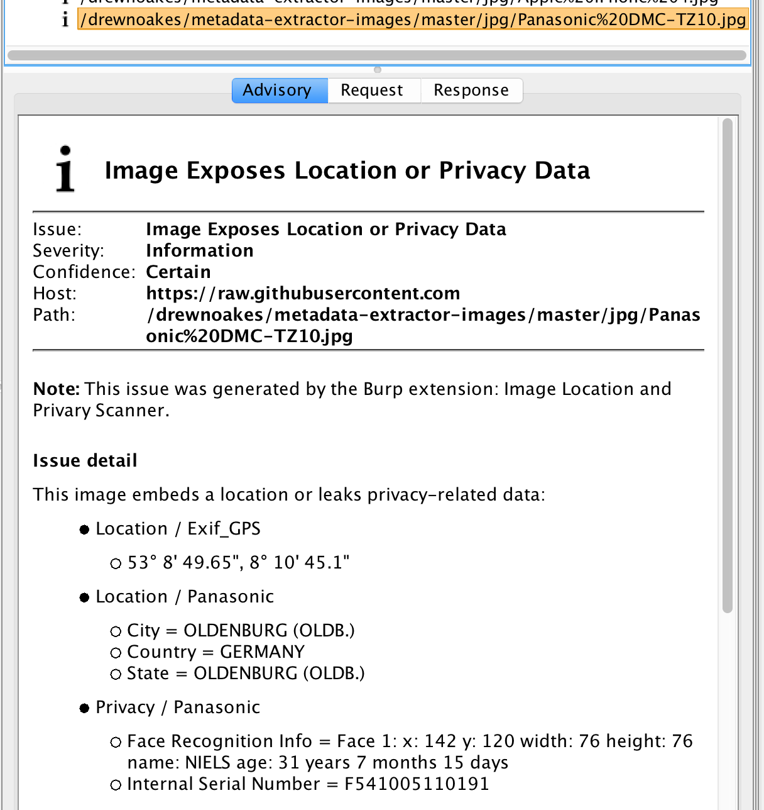

# Image Location and Privacy Scanner

Passively scans for GPS location and other privacy-related exposures in images during normal
security assessments of websites via plug-ins for both Burp & ZAP.  Image
Location and Privacy Scanner (ILS) assists in situations where end users may post profile
images and possibly give away their home location, e.g. a dating site or
children's chatroom.

More information on this topic, including a white paper
based on a real-world site audit given as a presentation at the New
Jersey chapter of the OWASP organization, can be found at
[www.veggiespam.com/ils/](https://www.veggiespam.com/ils/).

This software finds the GPS information inside of Exif tags, IPTC codes,
and proprietary camera codes. Then, the Image Location and Privacy Scanner flags the
findings in the
Burp Scanner or ZAP Alerts list as an information message.  It would be
up to the auditor to determine if location exposure is truly a security
risk based on context.

There are two major branches: *master* which is the mainline set of releases and *tng* which will be a next generation set of changes that may or may not compile when you clone the repo.  The master branch has tags for some released versions.

Special thanks to my [contributors, listed here](CONTRIBUTORS.md).
Full version history can be found in the [CHANGELOG.md](CHANGELOG.md).

## Sample Run

<p>
Configure the web browser to proxy through Burp or ZAP per the
instructions of those products.  Then, browse to a few sample sites to
see Alerts being raised:</p>

* MetaData Extractor's [SampleOutput page](https://github.com/drewnoakes/metadata-extractor/wiki/SampleOutput)
contains some good images.  But first, in order to view the URLs
below, you may need to obtain a GitHub session cookie first by going to
[MDE on GitHub](https://github.com/drewnoakes/metadata-extractor-images/tree/master/jpg).
    - [iPhone 4](https://raw.githubusercontent.com/drewnoakes/metadata-extractor-images/master/jpg/Apple%20iPhone%204.jpg)
    shows GPS data.
    - [FujiFilm FinePix S1 Pro](https://raw.githubusercontent.com/drewnoakes/metadata-extractor-images/master/jpg/FujiFilm%20FinePixS1Pro%20(1).jpg)
    has embedded IPTC locations and keywords.
    - [Panasonic DMC-TZ10](https://raw.githubusercontent.com/drewnoakes/metadata-extractor-images/master/jpg/Panasonic%20DMC-TZ10.jpg) shows proprietary Panasonic tags including city, state, country along
    with facial recognition information, like the name and age of the person in
    the picture.  Burp screen shot of this shown to the right and ZAP is
	shown below.
* This professional photographer leaves Exif & IPTC data in many photos: [Raia.com](https://raia.com/)

<p align="center"></p>

The ILS jar file contains a `main()` function, so it is possible to
directly run the scanner from the command line on local files.  The
classpath must contain the ILS jar file along with the supporting jars
for the MetaData Extractor and the Adobe XMP library.  To from the
command line, just do:

```bash
$ java -classpath build/libs/image-location-scanner-all.jar   com.veggiespam.imagelocationscanner.ILS
Java Image Location and Privacy Scanner v1.1
Usage: java ILS.class [-h|-t] file1.jpg file2.png file3.txt [...]
    -h : optional specifier to output results in semi-HTML format
    -t : optional specifier to output results in plain text format (default)

# Run main() directly from the Burp jar packaging
$ java -classpath build/libs/image-location-scanner-all.jar  com.veggiespam.imagelocationscanner.ILS [...files...]
Processing Panasonic DMC-TZ10.jpg :
  Location::
    Exif_GPS: 53° 8' 49.65", 8° 10' 45.1"
    Panasonic: City = OLDENBURG (OLDB.)
    Panasonic: Country = GERMANY
    Panasonic: State = OLDENBURG (OLDB.)
  Privacy::
    Panasonic: Face Recognition Info = Face 1: x: 142 y: 120 width: 76 height: 76 name: NIELS age: 31 years 7 months 15 days
    Panasonic: Internal Serial Number = F541005110191
Processing Panasonic Lumix DMC-LX7.jpg :
  Privacy::
    Panasonic: Internal Serial Number = F111311090158
Processing j2.jpg :
  Location::
    Exif_GPS: 40° 18' 54.92", -74° 39' 37.85"
Processing README.md : None
```

Note the names of the jar files could be different, please confirm them.


# Usage Requirements
The Image Location and Privacy Scanner runs as both a Burp and ZAP plug-in.
The required versions of those packages are:

* Burp Pro, 1.4 or newer from
  [PortSwigger Burp web site](https://portswigger.net/burp/Pro)
* ZAP, 2.7.x or newer from
  [OWASP ZAP web site](https://www.zaproxy.org)

## Burp Installation

Burp Application Store: Launch Burp and click Extender tab &rarr;
Bapp Store &rarr; left pane &rarr; Image Location and Privacy Scanner.  In the right window pane, the
version and description of the plug-in will be shown; click the Install
button to download and activate.

Manual Install: Go to Extender &rarr; Extensions &rarr; Add.  Choose the
type as Java, choose the Image Location and Privacy Scanner jar file (you built or
downloaded), leave Standard Output & Error as "Show in UI" and then
click Next.  The next screen will show the "Image Location and Privacy Scanner:
plug-in version 1.1" if successful or display errors on the Error tab.
Click close to return to Burp.

Note: This is a scanner-type plug-in and the scanner is disabled in Burp
Free version.  So, the plug-in will only function inside of Burp Pro.

## ZAP Installation

The Image Location and Privacy Scanner is available as part of the beta channel
in the ZAP Marketplace.  Currently, version 1.0 is present
in the channel and in the ZAP source code tree.  An
[issue](https://github.com/zaproxy/zaproxy/issues/4295) has been
made to elevate into the release channel.

Image Location and Privacy Scanner also can be downloaded and compiled directly
into ZAP.


# <a name="faq"> FAQ
* When I use Burp, no issues are displayed
	- By default, Burp hides the images and this has the side effect of also hiding any alerts detected by this plug-in.  So, you will need to enable **"Show Images"** in the filtering on the Target tab before you begin your sample testing.  Then, in the Target &rarr; Issues pane, you will see the privacy exposure alerts raised by Image Location and Privacy Scanner plug-in.
* Why do I see two sets of Exif_GPS coordinates  (or other tag)
	- This means the image has been embedded with multiple Exif tags of
	the same type.  Thus more than one GPS location can appear.  The ILS
	software displays all that are detected.
* You missed the serial number for Camera Type X
	- Could be true.  This information exposure list was built by
	manually scanning all tags available as part of MDE.  If something new was
	added, then ILS needs to also account for it.  File a bug report
	[on GitHub](https://github.com/veggiespam/ImageLocationScanner/issues) and I'll update in a future release.
* Why does it say "City = " with no city listed
	- It actually says "City = \\0\\0\\0\\0\\0 ..." with maybe 64 nulls.
	In newer versions ILS, we simply filter out strings that start with
	a null character.  We assume someone isn't hiding data there.
* When I use ZAP, nothing shows up
	- Before ZAP 2.7.x, you must manually enabled image scanning with: Tools &rarr; Options &rarr; Display &rarr; Process images in the HTTP requests/responses.
	- If you have images disabled in Global Exclude URL, then any
	passive image scanner, like ILS, will be unable to see the images
	and report on privacy issues.

## Build Requirements

* Java 1.9 or newer
* Gradle 1.6 or newer to build
* &dagger; [Burp Extender API](http://portswigger.net/burp/extender/api/burp_extender_api.zip)
  2.1; uses proprietary license
* &dagger; [MetaData Extractor](https://drewnoakes.com/code/exif/)
  version 2.13.0; uses Apache License v2.0
* &dagger; [XMP Library for Java](https://mvnrepository.com/artifact/com.adobe.xmp/xmpcore/6.0.6)
  version 6.0.6; uses BSD License

&dagger; These will be auto-fetched if you build with Gradle.

The Burp plug-in is built with Gradle: `gradle fatJar` (or be lazy and type `make`). After building, the plug-in can manually be loaded into Burp.  

To build for ZAP, it is easiest start by forking [ZAP Extensions](https://github.com/zaproxy/zap-extensions) or [my outdated repo](https://github.com/veggiespam/zap-extensions).  Then, overwrite your repo's ILS.java with the updated version.  Compile with `./gradlew :addOns:imagelocationscanner:build` and install *imagelocationscanner-{id}.zap* add-on file into ZAP.


# Random Future Todos
* Idea from Burp's @pajwigger:  It's quite common that servers return
  304 not modified. It might be a good trick, if you see a request for
  an image, and there's only 304s in the site map – that in an active
  scan you fetch the image.
* Need better testing and examples.
	* Get more IPTC test images with both location names and GPS
	  positions.  ILS tests for names, but it is unknown if IPTC
	  GPS works as no real world images have been provided for testing.
	* More testing with PNG & TIFF file types.  Burp and ZAP will flag
	  what ever MetaData Extractor finds.
	* Donate any new test images to MetaData Extractor project for
	  better cataloging.
* There is much repeated code.  It would be better to use function
  pointers.  String of subtype, Class type, int[] of TAGS.  One of
  these days, I'll do that.
* Get the ZAP version into the mainline build; at beta now, we need:
	1. Add i18n support, including a few translations.
	2. Custom wiki page on ZAP website.
	3. Dynamic Load() and Unload() -- is this required for passive scanners.
	4. Help file integration.
* More generalized research.  Images with embedded locations were found
  in a real-world situation with high privacy implications; thus a
  severe audit finding and the impetus for this project.  This images
  have also been seen on other sites with local expectations of privacy.
  However, we need people to try the tool when browsing sensitive sites,
  like dating or children-only social networking sites.  How pervasive
  is the issue on sensitive websites?
* White paper with better examples of "how to fix".
* Get a Eclipse + ZAP environment working so I can test those updates
  easier.
* For unit tests inside of the ZAP integration, add more test images for
  various cameras and location exposure, maybe a loop checking for this.
* For unit tests inside of the ZAP integration, create a test which uses
  different content types.

Keywords: Infosec, Burp, ZAP, Audit, Information Exposure, Vulnerability, GPS, Exif, XMP, IPTC, PII

<!--
vim: sw=4 ts=4 sts=4 spell noexpandtab
-->
